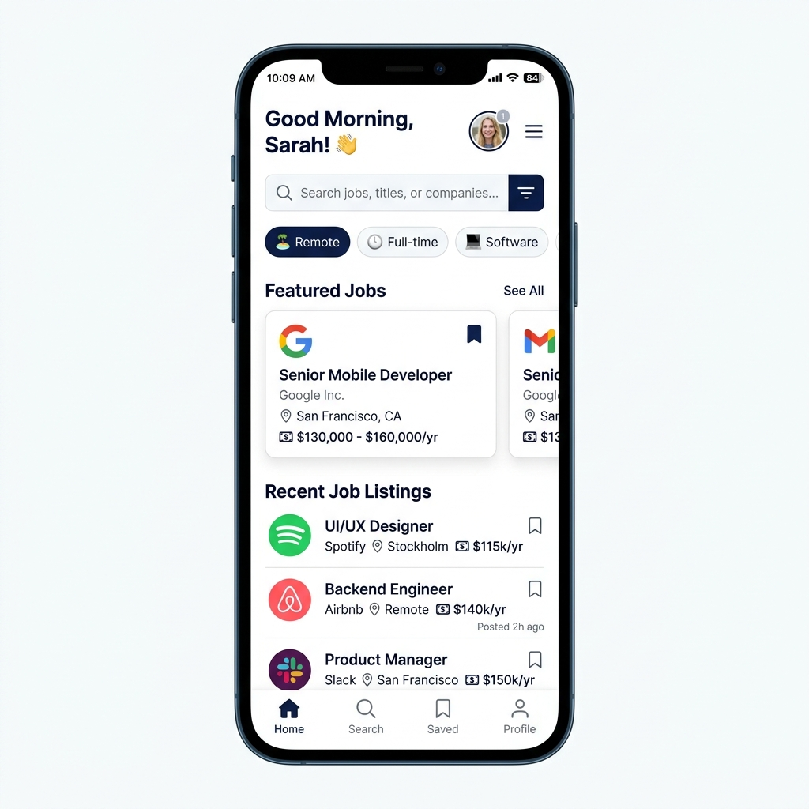
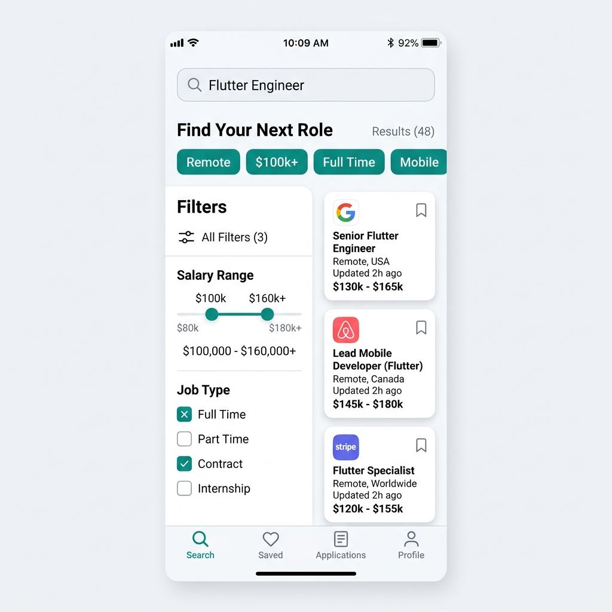
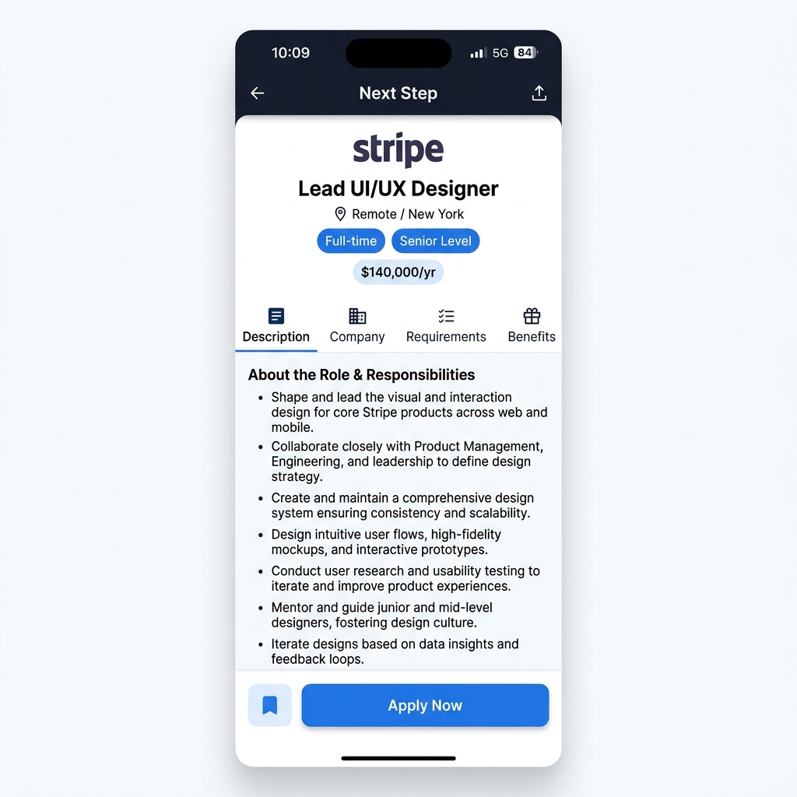
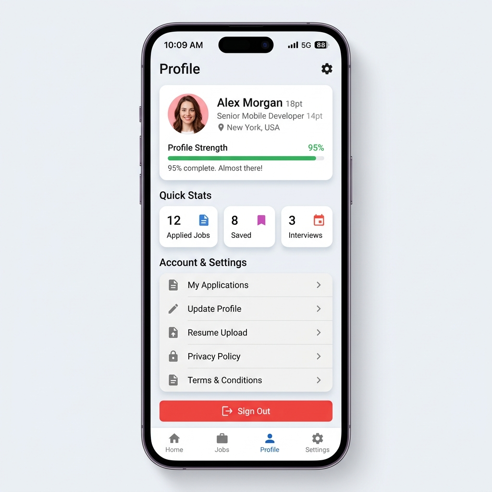

# 🚀 Next Step - Modern Job Search & Career Discovery App

[](https://flutter.dev)
[](https://dart.dev)
[](https://pub.dev/packages/get)
[](https://supabase.com)

**Next Step** is a cross-platform mobile application designed to simplify job searching, career discovery, and application tracking. Built with **Flutter**, **GetX**, and **Supabase**, Next Step offers job seekers a smooth, modern, and responsive user experience to browse listings, filter by job type and salary, save favorite positions, and apply directly with attached resumes.

---

## 📱 App Preview & UI Screenshots

<div align="center">

| Home & Job Discovery | Advanced Job Search | Job Details & Apply | Profile & Applications |
| :---: | :---: | :---: | :---: |
|  |  |  |  |

</div>

---

## ✨ Features Overview

### 🔐 Authentication & Onboarding
- **Interactive Onboarding**: Engaging visual introduction to guide new users through key platform capabilities.
- **Supabase Authentication**: Secure user registration, email/password login, password recovery, and guest access modes.
- **Protected Routes**: Middleware-based routing using GetX to guard authorized screens and complete onboarding workflows.

### 💼 Job Discovery & Home Feed
- **Featured & Recent Listings**: Dynamic feed displaying top job opportunities, company badges, location, salary ranges, and job types.
- **Categorized Search**: Instant filtering by job categories (Full-Time, Part-Time, Remote, Freelance).
- **Interactive Bookmarks**: Quick one-tap saving to store positions directly from the home feed.

### 🔍 Advanced Search & Smart Filtering
- **Keyword Search**: Instant query search matching job titles, company names, and skills.
- **Multi-criteria Filters**: Refine search results by employment type, role, salary boundaries, and country/location.

### 📄 Job Details & 1-Click Application
- **In-depth Specs**: View complete job descriptions, company information, key responsibilities, requirements, and benefits.
- **Resume Upload & Application**: Attach PDF/Word resumes via native file pickers and submit custom cover notes.
- **Application Status Feedback**: Real-time visual confirmation screen for application success or failure.

### 📊 Application Tracker & Profile Management
- **My Applications Dashboard**: Track all submitted job applications and their review status in one place.
- **Complete Profile Setup**: Customize career details, job preferences, select location (`countries.json`), and desired job roles (`jobRoles.json`).
- **Settings & Legal Information**: Access application settings, update account profile, view privacy policies, and manage sessions.

---

## 🛠️ Tech Stack & Architecture

- **Framework**: [Flutter](https://flutter.dev) (Dart SDK 3.10+)
- **State Management & Navigation**: [GetX](https://pub.dev/packages/get)
- **Backend & Database**: [Supabase Flutter](https://pub.dev/packages/supabase_flutter)
- **HTTP Networking**: [Dio](https://pub.dev/packages/dio) with [Pretty Dio Logger](https://pub.dev/packages/pretty_dio_logger)
- **Local Caching & Storage**: `shared_preferences`, `flutter_secure_storage`
- **Responsive Layout**: [flutter_screenutil](https://pub.dev/packages/flutter_screenutil) (Base design grid: 375x812)
- **Asset Pickers & Media**: `file_picker`, `image_picker`, `flutter_svg`, `cached_network_image`

---

## 📂 Project Structure

```text
lib/
├── core/
│   ├── constants/       # App constants, secret keys, colors, typography
│   ├── middleware/      # Auth, Guest, and Onboarding GetX route guards
│   ├── routing/         # App routes definition & navigation configuration
│   ├── services/        # Storage, Supabase client, and global services
│   └── theme/           # App themes, color manager, custom styles
├── features/
│   ├── apply/           # Application form, file upload & result screens
│   ├── auth/            # Login, register, forgot password screens & logic
│   ├── favorites/       # Saved / bookmarked jobs screen
│   ├── home/            # Home feed, job carousels & category chips
│   ├── jobs/            # Job details view, company info, requirements
│   ├── layout/          # Main navigation bar container & bottom bar
│   ├── profile_setup/   # Complete profile workflow, role & country picker
│   ├── search/          # Search bar, filter modal & search results
│   ├── settings/        # Settings screen, my applications, update profile
│   └── splash & onboarding/ # Splash logo animation & onboarding slider
├── main.dart            # Main entry point, service initialization
└── next_step.dart       # Root widget initializing ScreenUtil & GetMaterialApp
```

---

## 🚀 Getting Started

### Prerequisites

Ensure you have the following installed on your system:
- [Flutter SDK](https://docs.flutter.dev/get-started/install) (v3.10.8 or higher)
- Dart SDK (included with Flutter)
- Android Studio / Xcode (for device emulators and platform builds)

### Installation & Setup

1. **Clone the repository**:
   ```bash
   git clone https://github.com/your-username/next_step.git
   cd next_step
   ```

2. **Install Flutter dependencies**:
   ```bash
   flutter pub get
   ```

3. **Configure Supabase Credentials**:
   Update `lib/core/constants/app_secret.dart` with your Supabase URL and anon key:
   ```dart
   class AppSecret {
     AppSecret._();

     static const String supabaseUrl = 'https://YOUR-SUPABASE-PROJECT.supabase.co';
     static const String supabaseAnonKey = 'YOUR-SUPABASE-ANON-KEY';
   }
   ```

4. **Run the App**:
   ```bash
   # Run on connected mobile device or emulator
   flutter run

   # Run on Chrome Web
   flutter run -d chrome
   ```

---

## 📦 Building for Production

To create production binaries for target platforms:

```bash
# Android APK & App Bundle
flutter build apk --release
flutter build appbundle --release

# iOS (requires macOS and Xcode)
flutter build ios --release

# Web Deployment
flutter build web --release
```

---

## 📄 License

This project is open source and available under the [MIT License](LICENSE).

